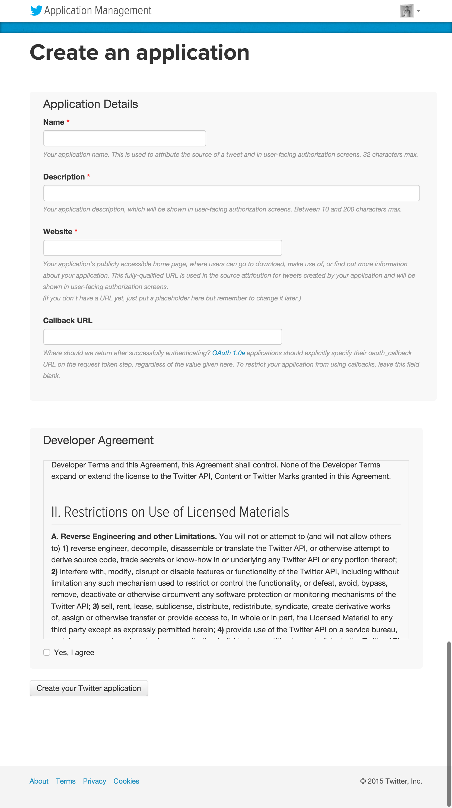

# Twitter Developer登録

Twitter認証のログインを行うためアプリケーション登録を済ませておいてください。

Twitterにログインした状態で [https://apps.twitter.com/](https://apps.twitter.com/) にアクセスします。

「Create New App」ボタンでアプリケーション登録を行います。

Application Detailsで、以下の内容を登録します。

* Name
* Description
* Website
* Callback URL

Twitter全体で、Nameは重複不可となっています。Descriptionは適当な文章で問題ありません。

Website / Callback URL には http://127.0.0.1:3000 を入力してください。

すべて入力したら利用規約に同意し、アプリケーションを作成してください。
